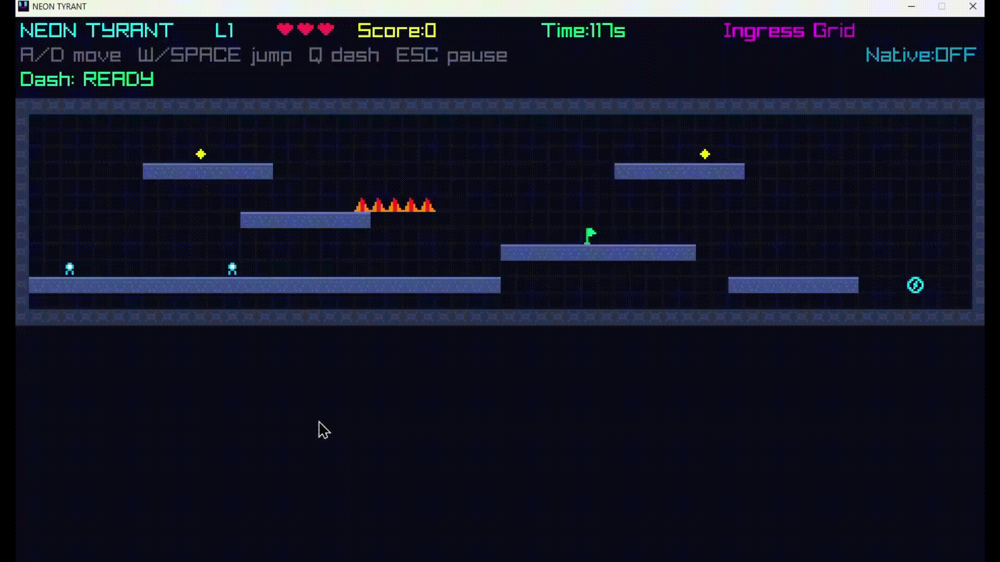

# Neon Tyrant

Windows multi-language platformer running in a Raylib window.



## Stack
- C# (.NET 8) for game loop and level flow
- Raylib-cs (`Raylib-cs` NuGet package) for window creation, drawing, and input
- C++ DLL for physics stepping and AABB collision tests
- C utility for score persistence
- Python for level validation
- BAT scripts for Windows build/run/clean
- PowerShell and shell scripts for smoother local workflow

## Prerequisites
- Windows 10/11
- Note: All you need is Windows 10 or 11 if you're going to download the app, if you're building and running locally, you will need the prequisites listed below
- .NET 8 SDK
- Python 3 (`python` in PATH)
- Optional: MSVC `cl.exe` (Visual Studio Build Tools) for native C/C++ modules


## How to Play

### Option 1: Run the .exe (no setup required)
Go to the `app/` folder and run **`NeonTyrant.exe`** — that's the only file you need to double-click. No .NET SDK or build tools needed; everything is bundled into a single self-contained executable.

### Option 2: Build and run locally
- Use `git clone https://github.com/atom-bowl/TyrantErr.git` to clone the repository
- Run `scripts\build.bat` to build the project
- Run `scripts\run.bat` to launch the game
- The game opens as a Raylib desktop window (`game_cs/src/Program.cs`)

#### Build
```bat
scripts\build.bat
```
If `cl.exe` is missing, the game still builds and runs in managed fallback mode.

PowerShell:
```powershell
./scripts/build.ps1
```

Shell:
```bash
./scripts/build.sh
```

#### Run
```bat
scripts\run.bat
```
PowerShell: `./scripts/run.ps1`  
Shell: `./scripts/run.sh`

#### Clean
```bat
scripts\clean.bat
```
PowerShell: `./scripts/clean.ps1`  
Shell: `./scripts/clean.sh`

#### Controls
- `A` / `D`: move
- `W` or `Space`: jump and attack
- `Q`: dash burst (cooldown based)
- `Esc`: pause

#### Notes
- Level data is stored in `assets/levels/`.
- High scores are persisted in `data/scores.csv`.
- Native features are auto-enabled when `physics.dll` and `score_store.exe` are present.
- The main window entrypoint is `game_cs/src/Program.cs` (`Raylib.InitWindow(...)`).
